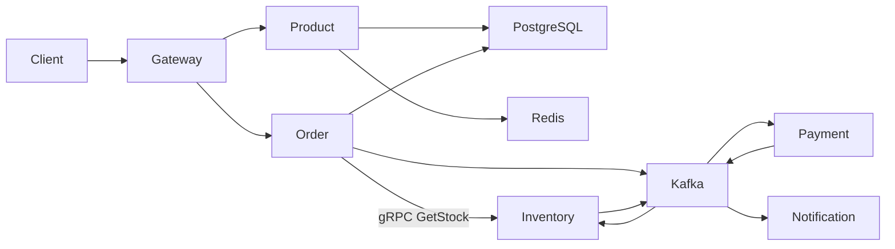
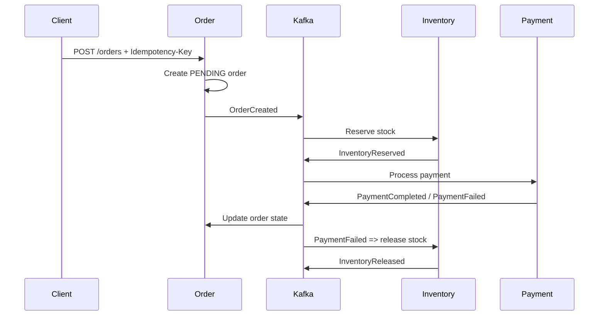

# Architecture

```mermaid
flowchart LR
  Client --> Gateway
  Gateway --> Product
  Gateway --> Order
  Product --> PostgreSQL
  Product --> Redis
  Order --> PostgreSQL
  Order -->|gRPC GetStock| Inventory
  Order --> Kafka
  Kafka --> Inventory
  Kafka --> Payment
  Kafka --> Notification
  Payment --> Kafka
  Inventory --> Kafka
```

## Order Saga

```mermaid
sequenceDiagram
  participant C as Client
  participant O as Order
  participant K as Kafka
  participant I as Inventory
  participant P as Payment

  C->>O: POST /orders + Idempotency-Key
  O->>O: Create PENDING order
  O->>K: OrderCreated
  K->>I: Reserve stock
  I->>K: InventoryReserved
  K->>P: Process payment
  P->>K: PaymentCompleted / PaymentFailed
  K->>O: Update order state
  K->>I: PaymentFailed => release stock
  I->>K: InventoryReleased
```
